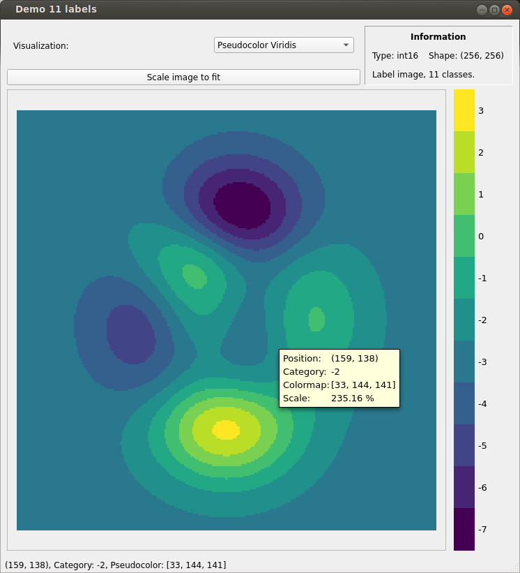

# iminspect

Utils to quickly visualize image-like data to allow faster-paced development.

# Python3 Package
`python3` utility package for image/matrix visualization.
## Dependencies
See `pip`-installable `<root>/python/requirements.txt`.
In particular, we need:
* PyQt5 - for the graphical user interface
* qimage2ndarray - conversion between numpy and Qt QImage data types
* numpy

## Demo

Example usage:
```python
from iminspect.inspector import inspect as inspect
import numpy as np

# Show as class labels:
inspect((np.random.rand(16,16) * 1e2 % 5).astype(np.int16), is_categoric=True)

# Random noise:
inspect(np.random.rand(4096,4096))
```

See also the provided demo application:
```bash
cd <root>/python/examples
python inspect_demo.py
```

Exemplary screenshot, visualizing categoric data (i.e. class labels):


## UI Documentation
* Zooming
  * `Ctrl+Wheel` to zoom in/out
  * Additionally holding `Shift` speeds up zooming
* Scrolling
  * Move the scroll bars
  * `Wheel` up/down
  * Additionally holding `Shift` speeds up scrolling
* Value at the cursor position will be displayed as tool tip and within the status bar


# TODO List
To be done:
* Explicit handling of flow (two layer flow/disparity ndarrays; default to flow wheel/disparity visualization)
* Add load from disk functionality (?)
* C++ port (leverage OpenCV UI 'capabilities' instead of qt)
* include additional pvt3 functionality (e.g. ROI selection widget)
* refactor (qt vs. custom naming schema)

